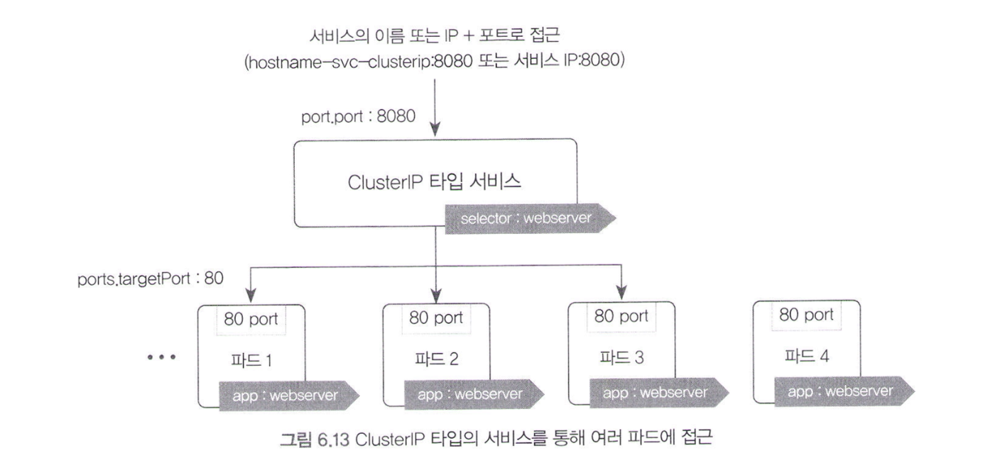
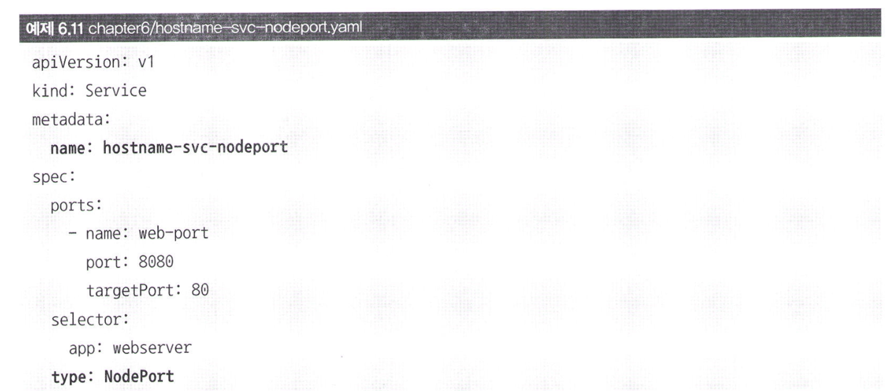
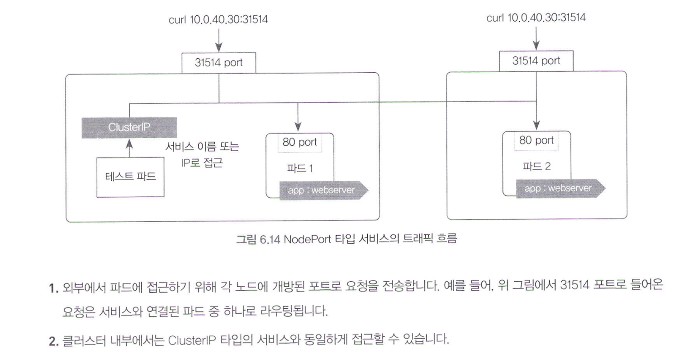
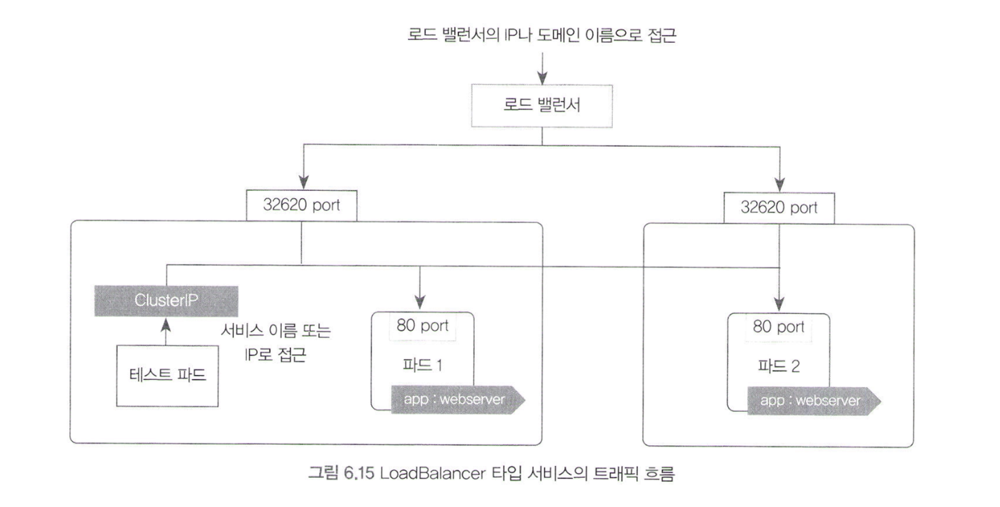

# 6.5 서비스

# Why Services?

디플로이먼트를 (deployment) 통해 어떻게 파드에 접근할 수 있을까요? kubectl describe를 사용해서 pod의 IP를 조회한 다음에 직접 연결할 수는 있지만, 해당 방법은 로컬 환경에서만 가능합니다. 

따라서, 이런 디플로이먼트들을 한번에 다 노출시킬 수 있는, 서로를 발견할 수 있는 무언가가 필요합니다.

### 이유
- 도커에서는 -p 옵션인 publish로 쉽게 외부로 노출 가능.
- 쿠버네티스는 이렇지 않음. YAML에서는 어플리케이션이 사용할 내부 포트만 정의 (containerPort).

따라서, 외부로 파드를 노출시키기 위해서는 서비스를 (service)라는 별도의 옵젝트를 사용해야 합니다.

파드에 접근하기 위해서는 반드시 존재해야 하는 옵젝트이기 때문에 배포를 할거면 무조건 서비스를 만들어야 합니다.

### 핵심 기능
- 여러 개의 파드에 쉽게 접근할 수 있게 고유한 도메인 네임을 제공.
- 여러 개의 파드에 접근할 때, 요청을 분산시키는 로드밸런싱 기능을 제공.
- 클라우드 플랫폼의 로드 밸런서, 클러스터 노드의 포트 등을 이용해서 외부로 노출.

# 6.5.1 서비스의 종류

쿠버네티스 서비스(service)의 종류는 파드에 어떻게 접근할지에 따라 여러 개로 세분화됩니다. 따라서, 목적에 맞게 서비스를 선택하면 됩니다.

여러가지 종류 중 가장 대표적으로 사용되는 종류는 다음과 같습니다:  

Types:
- ClusterIP: 쿠버네티스 내부에서만 파드들에 접근할 때 사용. 외부노출X.
- NodePort: 파드에 접근할 수 있는 포트를 클러스터의 모든 노드에 동일하게 개방. 외부접속가능. 접근할 포트는 랜덤으로 정해지지만, 특정 포트 설정도 가능.
- LoadBalancer: 클라우드 플렛폼에서 제공하는 로드 밸런서를 동적으로 프로비저닝해서 파드에 연결합니다. Nodeport와 유사하게 외부접속이 가능하지만, AWS, GCP 등과 같은 플렛폼 환경에서만 사용 가능.

In other words..
1. 내부만 -> ClusterIP
2. 외부도 -> NodePort
3. 실제운영 -> LoadBalancer

# 6.5.2 ClusterIP 타입 - 내부에서만 접근하기

- spec.selector: 이 서비스에서 어떤 라벨을 갖고 있는 파드를 접근 할 수 있게 만들지 결정.
- spec.ports.port: 서비스의 IP에 접근할 때 사용할 포트를 설정. 생성한 서비스는 내부에서만 사용할 수 있는 고유 IP(ClusterIP)가 생성됨.
- spec.ports.targetPort: 파드들이 내부적으로 사용하고 있는 포트를 입력. containerPort에서 사용할 포트를 80으로 선언했기 때문에 ports.targetPort을 80으로 설정. containerPort와 같은 포트로 설정해야함.
- spec.type: 타입 설정. ClusterIP, NodePort, LoadBalancer 등.

그래서 서비스를 조회해보면 hostname-svc-clusterip가 존재.
(kubernetes라는 이름의 서비스는 원래 관리를 위해 존재하는것)

아래는 임시 파드를 만들어서 내부 IP로 접근이 가능한지 확인해본건데, 역시 된다고 한다. 서비스와 연결된 여러 파드에 대해서 자동으로 로드 밸런싱을 수행하고 있는것을 알수가 있다. (별도 설정 없이)

파드는 IP뿐만 아니라 서비스 이름으로 접근 가능하다. 서비스나 파드를 쉽게 찾을 수 있도록 내부 DNS (Domain Name Service)를 구성하고 있기 때문. 실제로 여러 파드가 클러스터 내부에서 서로를 찾아 연결해야 할 때는 서비스의 이름과 같은 도메인 이름을 사용하는 것이 일반적. 즉 IP 없이 서비스의 이름인 도메인으로만 조회하는게 일반적.

### 정리

1. 특정 라벨을 가지는 파드를 서비스와 연결하기 위해서 서비스의 YAML 파일에 selector 항목을 정의
2. 파드에 접근할 때 쓰는 포트 (파드에 설정된 containerPort)를 YAML 파일의 targetPort에 정의.
3. 서비스를 설정할 때, YAML 파일의 port 항목에 8080을 명시해 서비스의 ClusterIP와 8080 포트로 접근 가능하게 설정.
4. `kubectl apply -f` 명령어로 ClusterIP 타입의 서비스가 생성되면 서비스는 클러스터 내부에서만 사용할 수 있는 고유한 내부 IP를 할당 받음.
5. 쿠버네티스 클러스터에서 서비스의 내부 IP 또는 서비스 이름으로 파드에 접근할 수 있음.

(단, ClusterIP기 때문에 외부 접속은 불가능)

selector와 파드의 라벨이 매칭돼 연결되면 k8s는 자동으로 엔드포인트(endpoint) 오브젝트를 생성. 이는 그야말로 서비스가 가리키는 도착점. 

지우는건 똑같이 `kubectl delete service`.

# 6.5.3 NodePort 타입

타입을 NodePort로 바꿔주는것 말고는 모두 동일.

그러나, NodePort를 실제 운영 환경에서는 쓰지 않는다. NodePort를 80 또는 443(HTTPS)으로 설정하기에는 부적절하며, SSL 인증서 적용, 라우팅 등이 복잡하여 서비스에 적용하기 어렵기 때문이라고 한다.

따라서, NodePort 오브젝트를 직접 외부로 제공하기보다 인그레스 (Ingress)라고 부르는 k8s 오브젝트로 간접적으로 사용되는 경우가 많다.

# 6.5.4 LoadBalancer 타입

LoadBalancer 오브젝트는 클라우드 플렛폼으로부터 도메인 이름과 IP를 할당받기 때문에 NodePort보다 더욱 쉽게 파드에 접근 가능. 단, AWS, GCP 등의 환경에서만 사용 가능.

- AWS에서는 kops를 설치한 쿠버네티스
- GCP는 GKE(Google Kubernetes Engine)

LoadBalancer 타입을 명시했지만, NodePort의 간접적인 기능 또한 사용할 수 있는 격.

### 온프레미스에서는 가능한지?

가능하지만, MetalLB 등의 특수한 환경을 직접 구축해야 한다.

# 6.5.5 externalTrafficPolicy

externalTrafficPolicy 설정이 Cluster으로 되어 있으면, 모든 노드에 랜덤한 포트를 개방하는 기본적인 방식이다. 이게 디폴특값. 

## 자료
- 시작하세요! 도커/쿠버네티스 (한빛미디어, 정원철)