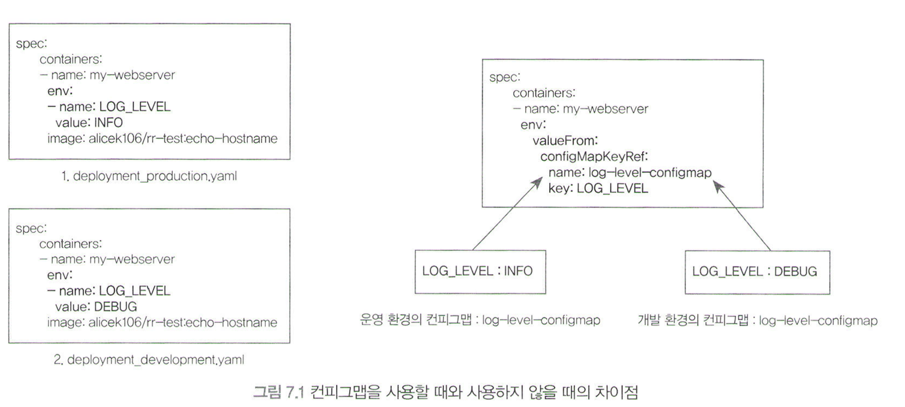
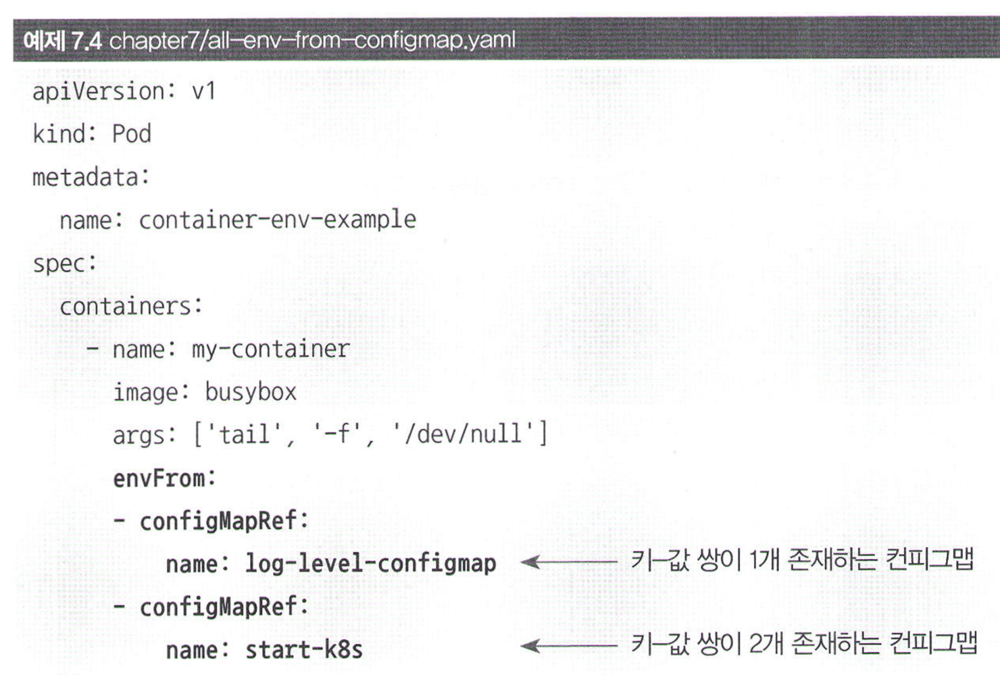
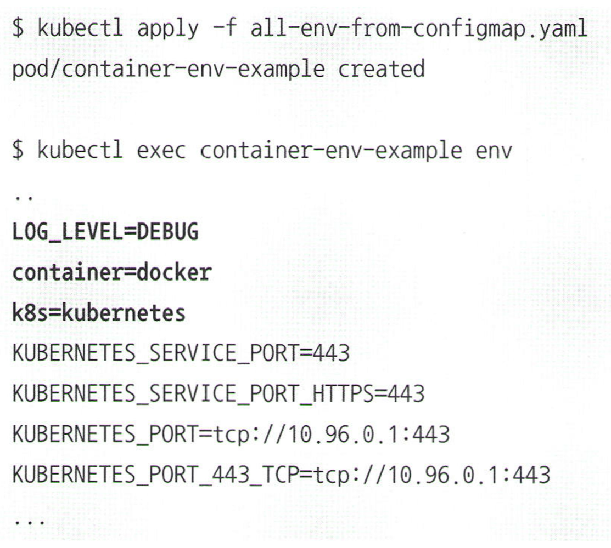
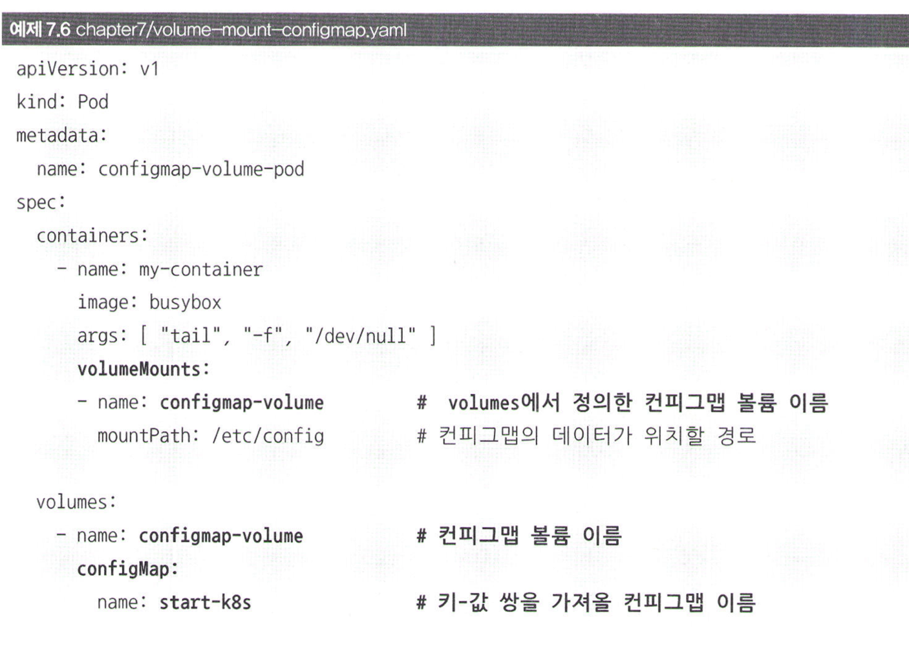
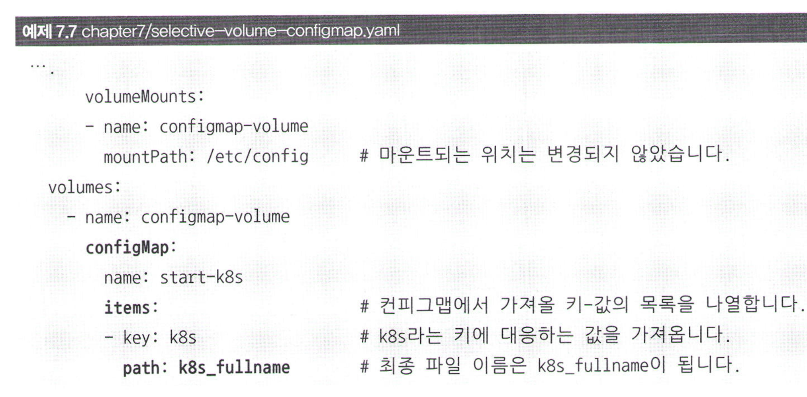
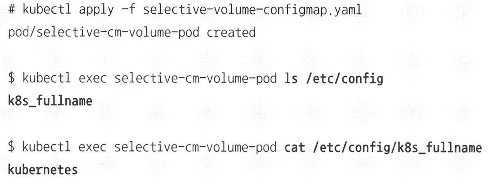

# 7.2.1 컨피그맵(Configmap)

# 서론

- 설정 옵션 도커 이미지 내부에 정적으로 저장 → 변경 불가
- 설정 옵션을 YAML 파일에 환경 변수 직접 적어 놓기 → 유연하게 변경 가능 
but 상황에 따라 환경 변수 값만 다른 여러 개의 파일 존재 가능(각각 디플로이먼트를 생성해야하는 경우)
    
    → YAML 파일과 설정값을 분리! : 컨피그맵(설정값) & 시크릿(비밀값)
    
    
    
- 도커 스웜 모드의 config, secret 개념과 매우 비슷

# 사용 방법

- 컨피그맵은 쿠버네티스 오브젝트이며 네임스페이스에 속함 → 네임스페이스별로 존재

## 생성 방법1

`kubectl create configmap <컨피그맵 이름> <각종 설정값들>`

- 예1) `kubectl create configmap log-level-configmap --from-literal LOG_LEVEL=DEBUG`
- 예2) `kubectl create configmap start-k8s --from-literal k8s=kubernetes --from literal container=docker`

## 생성 방법2

YAML 파일로 작성

- `--dry-run -o yaml` :컨피그맵을 생성하지 않은 채로 YAML 파일의 내용을 출력
1. `kubectl create configmap my-configmap --from-literal mykey=myvalue --dry-run -o yaml > my-configmap.yaml`
2. `kubetcl apply -f my-configmap.yaml`

## 확인

`kubectl describe configmap`

`kubectl get configmap -o yaml`

## 컨피그맵의 값을 파드로 가져오기

디플로이먼트 등의 YAML 파일에서 파드 템플릿 항목에 컨피그맵을 사용하도록 정의

 다 가져옴**
    
    
    
- `envFrom` : 여러 개의 키-값 쌍 존재하더라도 다 가져옴 (총 몇 개?)
    - 결과)
        
        
        
- **생성 방법 2) 선택해서 가져옴**
    
    
    
    
    
    - `valueFrom` & `configMapKeyRef` : 원하는 키-값 쌍만 선택적으로 가져옴
    - 결과)
        
        
        

### **2. 파드 내부의 파일로 마운트해 사용하는 경우**

- 앱이 nginx.conf, mysql.conf 등의 파일을 통해 설정값을 읽어 들이는 경우
- **생성 방법 1) 다 가져옴**
    
    
    
    - 결과: 키 이름으로 파일이 생성됨
        
        
        
- **생성 방법 2) 선택해서 가져옴**
    
    %20116ccd944abc80d899aedb820e8d63d5/image%209.png)
    
    - 결과
        
        
        
- **파일로부터 컨피그맵 생성하기**
    
    `kubectl create configmap <컨피그맵 이름> --from-file <파일 이름>`
    
    `kubectl create configmap index-file --from-file index.html`
    
    `kubectl create configmap index-file --from-file myindex=index.html`
    
    `kubectl create configmap <컨피그맵 이름> --from-env-file <파일 이름>`
    
    - 여러 개의 키-값 쌍이 저장된 설정 파일이 있을 때