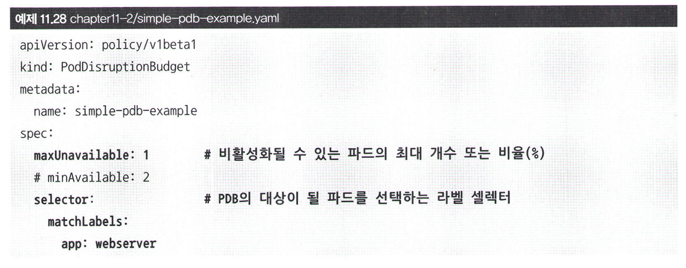
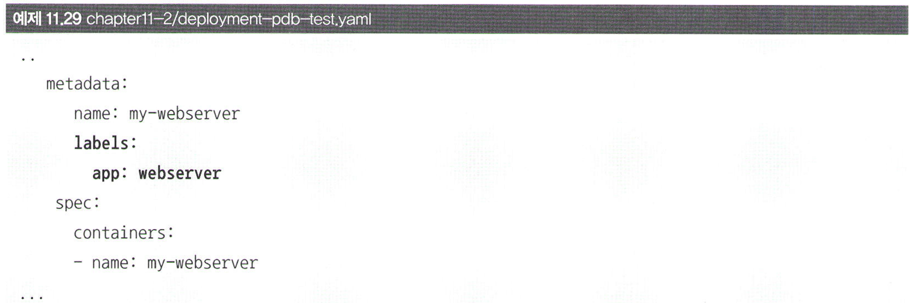

# 11.2.5 Cordon, Drain 및 PodDistributionBudget

### cordon

- kubectl cordon 명령어 사용
    
    ```bash
    # 얼룩 묻히기
    kubectl cordon <노드이름>
    kubectl cordon ip-10-43-0-30.ap-northeast-2.compute.internal
    
    # 얼룩 지우기
    kubectl uncordon <노드이름>
    ```
    
    
    
    - `Unschedulable: true` : 새로운 파드가 할당되지 않음, STATUS 항목에 SchedulingDisabled가 추가됨
    - `NoSchedule` 이므로 실행 중인 파드가 종료되지는 않음

### drain

- cordon이랑 비슷한데, 퇴거(Eviction)을 수행한다는 차이점이 있음 → 커널 버전 업그레이드, 유지 보수 등의 이유로 노드 잠시 중지할 때 유용
    
    ```bash
    # 얼룩 묻히기
    kubectl drain <노드이름>
    
    # 데몬셋 파드가 존재해서 drain할 없다는 에러가 뜨면?
    kubectl drain <노드이름> --ignore-daemonsets
    
    # 단일 파드가 존재한다고 에러가 뜨면? (즉, 디플로이먼트나 레플리카셋, 잡, 스테이트풀셋 등에 의해 생성되지 않은 파드의 경우)
    kubectl drain <노드이름> --force
    	# 근데 이러면 그냥 삭제랑 똑같음. 의미가 없음
    ```
    

### PodDistributionBudget (=pdb)

- 문제: 다른 노드에서 파드가 새롭게 생성되어 준비되기 전까지는 파드가 사용자 요청을 처리할 수 없음
- 해결: 특정 개수 또는 비율만큼의 파드를 반드시 정상적인 상태를 유지하도록 설정; pdb
- YAML 파일로 정의
    
    
    
    - 개수 또는 비율(30% 등) 로 설정 가능
    - `maxUnavailable`과 `minAvailable` 둘 중 하나만 정의해야 함. 맥락상 같은 기능이므로.
    - selector의 `matchLables`는  컨트롤러(디플로이먼트 등) 라벨이 아니라 파드의 라벨임! 디플로이먼트에 적용하려면 파드 스펙을 아래와 같이 정의
        
        